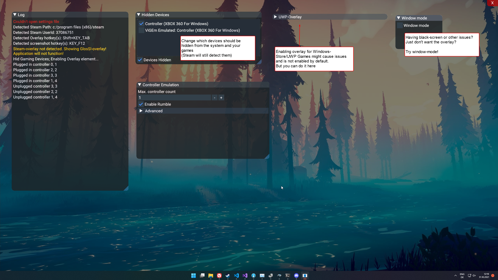

---
---

# GlosSI Overlay

GlosSI provides it's own overlay in addition to that of Steam.  

Simply open/close Steams overlay via your assigned shortcut or the Steam/Guide button **twice** to bring it up.  
From here you can take a peek at the log and change various settings.

In addition to Keyboard/Mouse, the overlay is also compatible with gamepad inputs.  
You can refer to the ImGui gamepad controls:  

