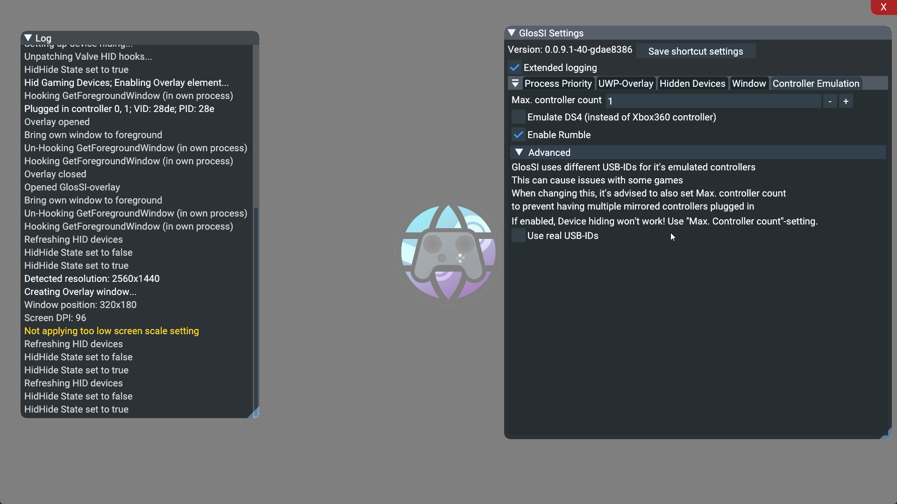
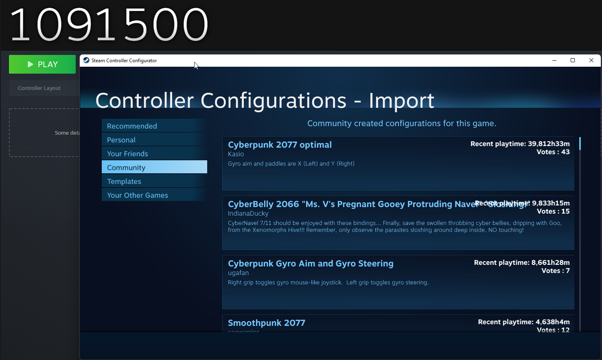

# How to use GlosSI 📖

## Table of contents

- [How to use GlosSI 📖](#how-to-use-glossi-)
  - [Table of contents](#table-of-contents)
  - [Installation 💿](#installation-)
    - [Installer](#installer)
    - [.zip file](#zip-file)
  - [Usage 🕹️](#usage-️)
    - [Prerequisites 🚨](#prerequisites-)
    - [Quick usage ⏱️ (Handy for troubleshooting!)](#quick-usage-️-handy-for-troubleshooting)
    - [Comfy usage 🧸](#comfy-usage-)
  - [Configuration ⚙️](#configuration-️)
    - [Pre-Launch configuration (GlosSIConfig)](#pre-launch-configuration-glossiconfig)
    - [On-the-fly configuration (GlosSI overlay)](#on-the-fly-configuration-glossi-overlay)
  - [Neat tips and tricks 😎](#neat-tips-and-tricks-)

## Installation 💿

### Installer

- Install, Reboot, Go! 🏎️

### .zip file

1. Extract the .zip-file to any directory on your computer
2. Install vc_redist_x64.msi
3. Install ViGEmBusSetup_x64.exe
4. Install HidHideSetup.exe
5. **Reboot(!)**

That's it! You're ready to use GlosSI 🙌

## Usage 🕹️

### Prerequisites 🚨

- Enable "XBox configuration support" in Steam
- Have Steam running

### Quick usage ⏱️ (Handy for troubleshooting!)

1. Add `GlosSITarget.exe` as a non-Steam Game to Steam
2. Setup controller configuration for the newly added shortcut in Steam
3. Launch _GlosSITarget_ from Steam

That's it! 🎉  
You can now launch any game/application just like you would without Steam.  
Enjoy global SteamInput as well as a systemwide Steam overlay. 💻🎮

**Please note:**
The overlay only works with _borderless window_ mode, **not** _exclusive fullscreen_.

In this mode, the overlay also does not work with UWP (≙ Windows Store)  
(When not manually enabled in GlosSI-overlay after launch)  
See [Comfy usage](#-comfy-usage), [configuration](#-configuration)

---

### Comfy usage 🧸

Since launching one thing from Steam and then launching a game outside of Steam is tedious, and leaves you with only a single controller configuration, GlosSI provides a handy shortcut-management and config app

Here's the basic gist to get you up and running using GlosSI

1. Launch GlosSIConfig.exe
2. Click the ➕-button to add a new shortcut that GlosSI should manage
3. Select the type of app you want GlosSI to launch for you  

- Select _UWP App_ for Windows-Store Apps
- Select _Win32 Program_ for "classic" programs and games
- Select _Add Manually_ in case you don't want GlosSI to launch anything or want to set up game launching at a later stage.
  - **If** you have selected _Add Manually_ enter the desired name for the shortcut

1. Click the _💾 Save_-button
2. Click the _➕ to Steam_-button
3. _Optional_ Repeat steps 2-5 if you want to add multiple shortcuts
4. **Restart Steam**
5. Setup controller configuration for the newly added shortcut in Steam
6. Search and launch your newly added shortcut from Steam

That's it! 🎉  
GlosSI should now launch your game, draw the SteamOverlay on top of it (_borderless window_ and _UWP_ only) and provide controller input redirection. 💻🎮

  
Screenies 📸

  

## Configuration ⚙️

### Pre-Launch configuration (GlosSIConfig)

GlosSIConfig provides a fair share of configuration options to tweak features to your liking as well as aid in troubleshooting.  
Most of the options have a `?`-button next to them that will provide a short description of what the option does.	

You do not need to worry about the advanced options too much, though, as the sane defaults should work for most supported use-cases

### On-the-fly configuration (GlosSI overlay)

Most, if not all, configuration options that are available in GlosSIConfig can also be changed on the fly using the GlosSI overlay.

To open/close the GlosSI overlay, open and close the SteamOverlay twice in rapid succession.

The GlosSI overlay can also be navigated with controller-inputs

  
Screenies 📸

  

## Neat tips and tricks 😎

- Want to use Steam community controller configs for a game you bought on a different store than Steam?

    Rename the shortcut in Steam to the Steam-AppID of the game you want to access to community-configs.  
    Community configs may only be available **before** you launch the shortcut.  
    AppIDs can be retrieved from [SteamDB](https://steamdb.info/apps/) or [Steambase](https://steambase.io/apps)

    

    
Screenie 📸

    

    
  
